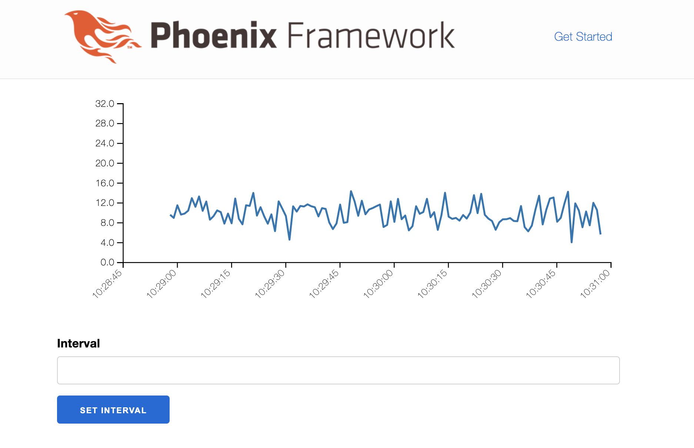
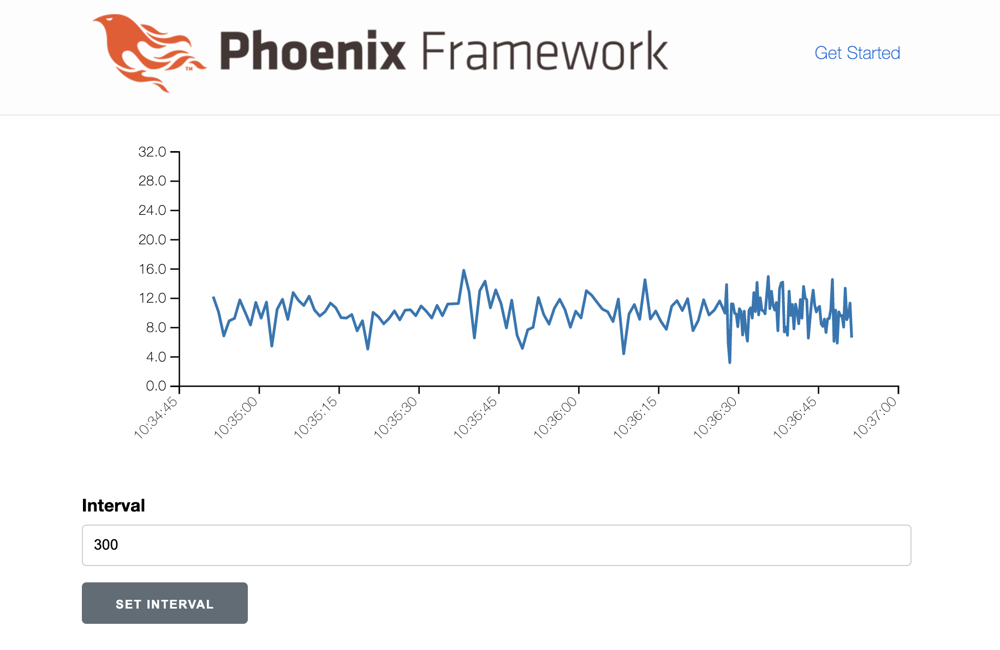
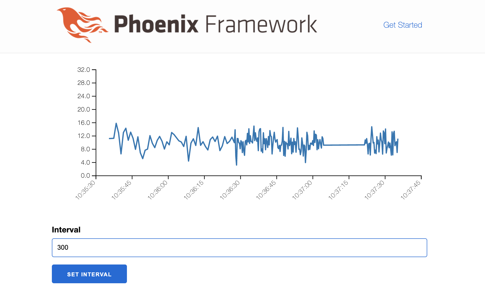

# MQTT for Elixir

## Introduction

Recently I have read an awesome book [Build a Weather Station with Elixir and Nerves](https://pragprog.com/titles/passweather/build-a-weather-station-with-elixir-and-nerves/).
It introduces Elixir as a tool for building embedded applications.

With [Nerves](https://www.nerves-project.org/) we can
run Elixir code on network-enabled devices interacting with
some controlling software and each other.

The aforementioned book mostly focuses on the Nerves part and
uses HTTP protocol for network interactions. Although this is
a reasonable choise in many situations, I want to introduce another
option that is widely used for production IoT setups: [MQTT](https://mqtt.org/).

## MQTT Protocol

[MQTT](https://mqtt.org/) is a messaging protocol designed specifically for (IoT) device
communications. It is used in many areas, such as banking, oil & gas industry, manufacturing, etc.

MQTT protocol has many advantages, but here I want to mention some of them:

* It is a lightweight binary protocol generally running over TCP/IP.
* It is designed for unreliable networking which makes it a good choise for outdoor installations.
* It follows pub/sub model simplifying client logic.

We will demonstrate some of MQTT advantages in our setup.

## MQTT Brokers

An essential thing about MQTT is that it simplifies client logic, which is important for embedded devices.
This is achieved with pub/sub model: in MQTT there is no concept of a "server".
All participating entities are clients connecting to a so called _broker_.
Client _subscribe_ to _topics_, _publish_ messages to them, and the broker does the routing (and many other things).

A good production ready broker, like [EMQX](https://github.com/emqx/emqx) generally provides
not only MQTT routing capabilities, but many other intellectual features, like
* other kinds of connection methods, like webscokets;
* different models of authentication and authorization;
* streaming data to databases;
* custom routing rules based on message introspection;
* and so on.

## Sensor Setup

For the sake of simplicity, our device will be represented by an ordinary Mix
application: it can be easily converted to a Nerves application.

First, we create a Mix project:

```bash
mix new --sup weather_sensor
cd weather_sensor
```

To interact with MQTT broker we need an MQTT client. We take [emqtt](https://github.com/emqx/emqtt)
add it to `mix.exs` as a dependancy:

```elixir
defp deps do
  [
    {:emqtt, github: "emqx/emqtt", tag: "1.4.4"}
  ]
end
```

```bash
# we do not want to use and build QUIC capabilities
export BUILD_WITHOUT_QUIC=1
mix deps.get
```

We will put all our "sensor" code to the main module `WeatherSensor`, so we need to
add it to the application supervisor `lib/weather_sensor/application.ex`:

```elixir
defmodule WeatherSensor.Application do
  @moduledoc false

  use Application

  @impl true
  def start(_type, _args) do
    children = [
      WeatherSensor
    ]

    opts = [strategy: :one_for_one, name: WeatherSensor.Supervisor]
    Supervisor.start_link(children, opts)
  end
end
```

Now, let's implement the main module in `lib/weather_sensor.ex`:

```elixir
defmodule WeatherSensor do
  @moduledoc false

  use GenServer

  def start_link([]) do
    GenServer.start_link(__MODULE__, [])
  end

  def init([]) do
    interval = Application.get_env(:weather_sensor, :interval)
    emqtt_opts = Application.get_env(:weather_sensor, :emqtt)
    # This is the topic to which we will publish our reports
    report_topic = "/reports/#{emqtt_opts[:clientid]}/temperature"
    {:ok, pid} = :emqtt.start_link(emqtt_opts)

    timer = :erlang.start_timer(interval, self(), :tick)
    {:ok,
      %{
        interval: interval,
        timer: timer,
        report_topic: report_topic,
        pid: pid
      },
      {:continue, :start_emqtt}}
  end

  def handle_continue(:start_emqtt, %{pid: pid} = st) do
    # Here we make actual connection to the broker
    {:ok, _} = :emqtt.connect(pid)
    emqtt_opts = Application.get_env(:weather_sensor, :emqtt)
    clientid = emqtt_opts[:clientid]
    # From this topic we will receive commands
    {:ok, _, _} = :emqtt.subscribe(pid, {"/commands/#{clientid}/set_interval", 1})
    {:noreply, st}
  end

  def handle_info({:timeout, _ref, :tick}, %{report_topic: topic, pid: pid} = st) do
    report_temperature(pid, topic)
    {:noreply, ensure_timer(st)}
  end

  def handle_info({:publish, publish}, st) do
    IO.inspect(publish)
    handle_publish(parse_topic(publish), publish, st)
  end

  defp handle_publish(["commands", _, "set_interval"], %{payload: payload}, st) do
    new_interval = String.to_integer(payload)
    {:noreply, %{st | interval: new_interval}}
  end

  defp handle_publish(_, _, st) do
    {:noreply, st}
  end

  defp ensure_timer(%{timer: timer, interval: interval} = st) do
    :erlang.cancel_timer(timer)
    new_timer = :erlang.start_timer(interval, self(), :tick)
    %{st | timer: new_timer}
  end

  defp parse_topic(%{topic: topic}) do
    String.split(topic, "/", trim: true)
  end

  defp report_temperature(pid, topic) do
    temperature = 10.0 + 2.0 * :rand.normal()
    message = {:os.system_time(:millisecond), temperature}
    payload = :erlang.term_to_binary(message)
    :emqtt.publish(pid, topic, payload)
  end
end
```

And put some options to `config/config.exs`:

```elixir
import Config

config :weather_sensor, :emqtt,
  host: '127.0.0.1',
  port: 1883,
  clientid: "weather_sensor",
  clean_start: false,
  name: :emqtt

config :weather_sensor, :interval, 1000
```

Let us summarize a bit what happens in `WeatherSensor`:
* It implements `GenServer` behaviour.
* When starting, it
    * opens an MQTT connection;
    * subscribes to `/commands/weather_sensor/set_interval` topic for receiving commands, received data will
    be sent to the process by `:emqtt` as `{:publish, publish}` messages.
    * schedules timer with a predefined interval.
* On timer timeout, it publishes `{Timestamp, Temperature}` tuple to `/reports/weather_sensor/temperature` topic.
* On receiving a message from `/commands/weather_sensor/set_interval` topic, it updates timer interval.

Since our appliation is not a real Nerves application with a sensor like BMP280 attached, we just generate temperature data.

Here we can already see one advantage over HTTP interaction: we can not only send data,
but also receive some commands in real time.

## Dashboard Setup

Since there are no "servers" in MQTT, our controlling dasboard will also be an MQTT client.
But it will *subscribe* to `/reports/weather_sensor/temperature` topic and *publish* commands to
`/commands/weather_sensor/set_interval`.

For a dashbord, we will setup a Phoenix LiveView application.

Let's create it:

```bash
mix phx.new --version
Phoenix installer v1.6.2
mix phx.new weather_dashboard --no-ecto --no-gettext --no-dashboard --live
cd weather_dashboard
```

Add dependencies to `mix.exs`

```elixir
  defp deps do
    [
      ...
      {:jason, "~> 1.2"},
      {:plug_cowboy, "~> 2.5"},

      {:emqtt, github: "emqx/emqtt", tag: "1.4.4"},
      {:contex, github: "mindok/contex"} # We will need this for SVG charts
    ]
  end
```

```bash
# we do not want to use and build QUIC capabilities
export BUILD_WITHOUT_QUIC=1
mix deps.get
```

Add some settings to `config/dev.exs`:

```elixir
config :weather_dashboard, :emqtt,
  host: '127.0.0.1',
  port: 1883

config :weather_dashboard, :sensor_id, "weather_sensor"

# Period for chart
config :weather_dashboard, :timespan, 60
```

Now we generate a LiveView controller:

```bash
mix phx.gen.live Measurements Temperature temperatures  --no-schema --no-context
```

This generates a lot of files but we will need only some of them, since we need a
single page application with a chart.
```bash
rm lib/weather_dashboard_web/live/temperature_live/form_component.*
rm lib/weather_dashboard_web/live/temperature_live/show.*
rm lib/weather_dashboard_web/live/live_helpers.ex
```
Also remove `import WeatherDashboardWeb.LiveHelpers` from `lib/weather_dashboard_web.ex`.


Update template for our page (`lib/weather_dashboard_web/live/temperature_live/index.html.heex`):

```elixir
<div>
  <%= if @plot do %>
    <%= @plot %>
  <% end %>
</div>

<div>
  <form phx-submit="set-interval">
    <label for="interval">Interval</label>
    <input type="text" name="interval" value={@interval}/>
    <input type="submit" value="Set interval"/>
  </form>
</div>
```

On this page we have a chart and an input control to send commands to our "device".

Now update the major part, LiveView controller (`lib/weather_dashboard_web/live/temperature_live/index.ex`):

```elixir
defmodule WeatherDashboardWeb.TemperatureLive.Index do
  use WeatherDashboardWeb, :live_view

  require Logger

  @impl true
  def mount(_params, _session, socket) do
    reports = []
    emqtt_opts = Application.get_env(:weather_dashboard, :emqtt)
    {:ok, pid} = :emqtt.start_link(emqtt_opts)
    {:ok, _} = :emqtt.connect(pid)
    # Listen reports
    {:ok, _, _} = :emqtt.subscribe(pid, "/reports/#")
    {:ok, assign(socket,
      reports: reports,
      pid: pid,
      plot: nil,
      interval: nil
    )}
  end

  @impl true
  def handle_params(_params, _url, socket) do
    {:noreply, socket}
  end

  @impl true
  def handle_event("set-interval", %{"interval" => interval_s}, socket) do
    case Integer.parse(interval_s) do
      {interval, ""} ->
        id = Application.get_env(:weather_dashboard, :sensor_id)
        # Send command to device
        topic = "/commands/#{id}/set_interval"
        :ok = :emqtt.publish(
          socket.assigns[:pid],
          topic,
          :erlang.integer_to_binary(interval),
          retain: true
        )
        {:noreply, assign(socket, interval: interval)}
      _ ->
        {:noreply, socket}
    end
  end

  def handle_event(name, data, socket) do
    Logger.info("handle_event: #{inspect([name, data])}")
    {:noreply, socket}
  end

  @impl true
  def handle_info({:publish, packet}, socket) do
    handle_publish(parse_topic(packet), packet, socket)
  end

  defp handle_publish(["reports", id, "temperature"], %{payload: payload}, socket) do
    if id == Application.get_env(:weather_dashboard, :sensor_id) do
      report = :erlang.binary_to_term(payload)
      {reports, plot} = update_reports(report, socket)
      {:noreply, assign(socket, reports: reports, plot: plot)}
    else
      {:noreply, socket}
    end
  end

  defp update_reports({ts, val}, socket) do
    new_report = {DateTime.from_unix!(ts, :millisecond), val}
    now = DateTime.utc_now()
    deadline = DateTime.add(DateTime.utc_now(), - 2 * Application.get_env(:weather_dashboard, :timespan), :second)
    reports =
      [new_report | socket.assigns[:reports]]
      |> Enum.filter(fn {dt, _} -> DateTime.compare(dt, deadline) == :gt end)
      |> Enum.sort()

    {reports, plot(reports, deadline, now)}
  end

  defp parse_topic(%{topic: topic}) do
    String.split(topic, "/", trim: true)
  end

  defp plot(reports, deadline, now) do
    x_scale =
      Contex.TimeScale.new()
      |> Contex.TimeScale.domain(deadline, now)
      |> Contex.TimeScale.interval_count(10)

    y_scale =
      Contex.ContinuousLinearScale.new()
      |> Contex.ContinuousLinearScale.domain(0, 30)

    options = [
      smoothed: false,
      custom_x_scale: x_scale,
      custom_y_scale: y_scale,
      custom_x_formatter: &x_formatter/1,
      axis_label_rotation: 45
    ]

    reports
    |> Enum.map(fn {dt, val} -> [dt, val] end)
    |> Contex.Dataset.new()
    |> Contex.Plot.new(Contex.LinePlot, 600, 250, options)
    |> Contex.Plot.to_svg()
  end

  defp x_formatter(datetime) do
    datetime
    |> Calendar.strftime("%H:%M:%S")
  end

end
```

There are some things to note.
* We created a LiveView handler to serve the main page of our app.
* Normally, `Phoenix.PubSub` is used to update a LiveView process state, but we make a nice trick: since
an MQTT broker already provides pubsub model we connect directly to it from our LiveView process.
* On receiving new temperature data, server updates temperature chart.
* On receiving form update from a user, we send updated interval to the command topic.

Finally, set up routing in `lib/weather_dashboard_web/router.ex` so that our controller handles the root page:

```elixir
  scope "/", WeatherDashboardWeb do
    pipe_through :browser

    live "/", TemperatureLive.Index
  end
```

## Tying Parts Together

Now we are ready to set all the things up and running.

We run MQTT broker. Since currently we do not want any special settings, the simplest way is to
run broker with docker.

```bash
docker run -d --name emqx -p 1883:1883 emqx/emqx:4.3.10
```

Now we run our "device":

```bash
cd weather_sensor
export BUILD_WITHOUT_QUIC=1
iex -S mix
Erlang/OTP 24 [erts-12.1.2] [source] [64-bit] [smp:16:16] [ds:16:16:10] [async-threads:1] [jit] [dtrace]

....

13:17:24.461 [debug] emqtt(weather_sensor): SEND Data: {:mqtt_packet, {:mqtt_packet_header, 8, false, 1, false}, {:mqtt_packet_subscribe, 2, %{}, [{"/commands/weather_sensor/set_interval", %{nl: 0, qos: 1, rap: 0, rh: 0}}]}, :undefined}

13:17:24.463 [debug] emqtt(weather_sensor): RECV Data: <<144, 3, 0, 2, 1>>

13:17:25.427 [debug] emqtt(weather_sensor): SEND Data: {:mqtt_packet, {:mqtt_packet_header, 3, false, 0, false}, {:mqtt_packet_publish, "/reports/weather_sensor/temperature", :undefined, :undefined}, <<131, 104, 2, 110, 6, 0, 179, 156, 178, 158, 125, 1, 70, 64, 38, 106, 91, 64, 234, 212, 185>>}

13:17:26.428 [debug] emqtt(weather_sensor): SEND Data: {:mqtt_packet, {:mqtt_packet_header, 3, false, 0, false}, {:mqtt_packet_publish, "/reports/weather_sensor/temperature", :undefined, :undefined}, <<131, 104, 2, 110, 6, 0, 156, 160, 178, 158, 125, 1, 70, 64, 39, 115, 221, 187, 144, 192, 31>>}
...
```

We see that our sensor immediately started to send reports.

Now run our dashboard:

```bash
cd weather_dashboard
export BUILD_WITHOUT_QUIC=1
iex -S mix phx.server
Erlang/OTP 24 [erts-12.1.2] [source] [64-bit] [smp:16:16] [ds:16:16:10] [async-threads:1] [jit] [dtrace]

[info] Running WeatherDashboardWeb.Endpoint with cowboy 2.9.0 at 127.0.0.1:4000 (http)
[info] Access WeatherDashboardWeb.Endpoint at http://localhost:4000
Interactive Elixir (1.12.3) - press Ctrl+C to exit (type h() ENTER for help)
iex(1)> [watch] build finished, watching for changes...
```

Let's navigate to [http://localhost:4000](http://localhost:4000).

We see that a corresponding LiveView process mounted, connected to the broker and started to receive
temperature data:

```elixir
[info] GET /
[info] Sent 200 in 145ms
[info] CONNECTED TO Phoenix.LiveView.Socket in 129µs
  Transport: :websocket
  Serializer: Phoenix.Socket.V2.JSONSerializer
  Parameters: %{"_csrf_token" => "cwoROxAwKFo7NEcSdgMwFlgaZ1AlBxUa6FIRhAbjHA6XORIF-EUiIRqU", "_mounts" => "0", "_track_static" => %{"0" => "http://localhost:4000/assets/app.css", "1" => "http://localhost:4000/assets/app.js"}, "vsn" => "2.0.0"}
[debug] emqtt(emqtt-MacBook-Pro-iaveryanov-86405372ddbf17052130): SEND Data: {:mqtt_packet, {:mqtt_packet_header, 1, false, 0, false}, {:mqtt_packet_connect, "MQTT", 4, false, true, false, 0, false, 60, %{}, "emqtt-MacBook-Pro-iaveryanov-86405372ddbf17052130", :undefined, :undefined, :undefined, :undefined, :undefined}, :undefined}
[debug] emqtt(emqtt-MacBook-Pro-iaveryanov-86405372ddbf17052130): RECV Data: <<32, 2, 0, 0>>
[debug] emqtt(emqtt-MacBook-Pro-iaveryanov-86405372ddbf17052130): SEND Data: {:mqtt_packet, {:mqtt_packet_header, 8, false, 1, false}, {:mqtt_packet_subscribe, 2, %{}, [{"/reports/#", %{nl: 0, qos: 0, rap: 0, rh: 0}}]}, :undefined}
[debug] emqtt(emqtt-MacBook-Pro-iaveryanov-86405372ddbf17052130): RECV Data: <<144, 3, 0, 2, 0>>
[debug] emqtt(emqtt-MacBook-Pro-iaveryanov-86405372ddbf17052130): RECV Data: <<48, 58, 0, 35, 47, 114, 101, 112, 111, 114, 116, 115, 47, 119, 101, 97, 116,
  104, 101, 114, 95, 115, 101, 110, 115, 111, 114, 47, 116, 101, 109, 112, 101,
  114, 97, 116, 117, 114, 101, 131, 104, 2, 110, 6, 0, 180, 251, 188, 158, 125,
...
```

Also, the page started to update immediatly:



If we update interval, we see that the device node receives command
immediatly and starts to update more frequently:



Now we demonstrate one important thing: let's stop our "device" node, wait a bit and start it again.
We see that the node continued to send data with the updated frequency.



How could that happen? The secret is simple: the `retain` flag of command messages that we send to the command topic.

``` elixir
:ok = :emqtt.publish(
  socket.assigns[:pid],
  topic,
  :erlang.integer_to_binary(interval),
  retain: true
)
```

When we send a message with `retain` flag to a topic, this message becomes also a "default" message. The broker
keeps it, and each subscriber to the topic receives this message on subscribe.

This feature is especially important for embedded devices that may go offline often and do not have any easy to use
local storage to keep their state. This is the way to get them correctly configured on connect.

## Conclusion

In this article we

* demonstrated a popular way of interaction with embedded devices — MQTT protocol;
* we introduced it's usage in Elixir;
* we also demonstrated some advantages of MQTT such as pubsub model and message retaining.

Other powerful features thaw we might want to use even in a simple setup are:
* streaming topic data into database so that we could display history on connect without "manual" saving;
* using [MQTT.js](https://github.com/mqttjs/MQTT.js) to connect to the broker directly from the frontend through WebSockets.

All the code is available at [https://github.com/savonarola/mqtt-article](https://github.com/savonarola/mqtt-article).
